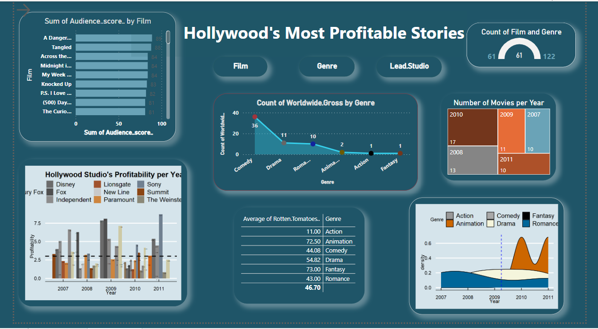

# RSudio-and-Power-BI

## Purpose

Performing cleaning and Statistical Analysis of "Hollywood's Most Profitable Stories" dataset with R and Data Visualisation on Power BI.

## Techniques

### 1. Data cleaning.

Checking missing values.  

Removing duplicates and rounding the values to maintain accuracy and avoid misleading statistics.

Checking for outliers using a boxplot.
Methods such as IQR criterion by using boxplot.stats()$out and function which() to extract the row number corresponding to these outliers, z-score and Hampel filter by using median() and mad() functions.

### 2. Exploratory Data Analysis 

This set of statistics describes where data values occur, their central tendency, variability, and the
general shape of their distribution. 

Univariate (bar charts, histogram) , bivariate (scatter plots) and multivariate analysis for multiple variables.

### 3. Data Visualization on Power BI

Creating dashboards by using Rscripts with different packages(ggplot, reshape2, dplyr, ggthemes, ggridge, plotly, rgl etc) and collections of functions for bar chart and density plot.

https://app.powerbi.com/links/PtZ6SXLsJ3?ctid=6efd0f20-57c8-4447-b53f-00d4992ca50b&pbi_source=linkShare

